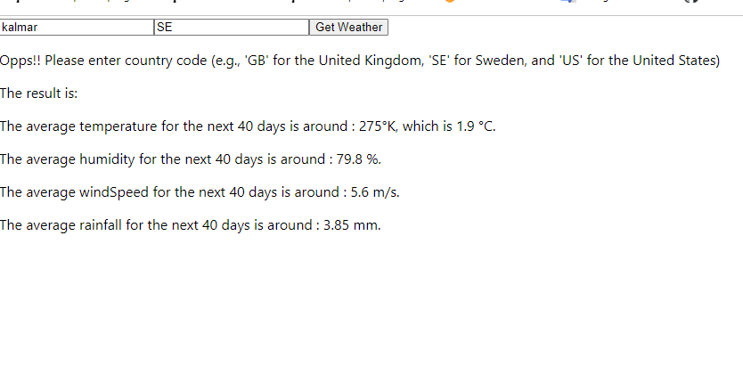

## Weather-module user's guide

### programming language:
JavaScript

#### This Weather-Module enables you to easily integrate weather data fetching capabilities into your application. It allows you to retrieve and compute various weather-related data such as average temperature, humidity, wind speed, and maximum rainfall forecasts for the next 40 days, using data from OpenWeatherMap API.

## Importing and using the module
#### In your application, import the main function from the weather-module and call it with the required parameters:

import { main } from 'weather-module'

## Usage
#### To use this module, you will need to pass your OpenWeatherMap API key as an environment variable. Below is an example of how you might use the Weather-Module in a React application:

REACT_APP_OPENWEATHERMAP_API_KEY='your_actual_api_key_here'

#### Make sure to replace 'your_actual_api_key_here' with the API key you've obtained from OpenWeatherMap. Remember to add '.env' to your '.gitignore' file to prevent your API key from being committed to your repository.

#### In your application (like a React app), you would pass the environment variable when calling main and call the main function and await the results:

import { main } from 'weather-module'

const result = await main(city, country, process.env.REACT_APP_OPENWEATHERMAP_API_KEY)

const weatherResults = await main(city, country, apiKey)

console.log('Weather Results:', weatherResults)

### The data obtained is roughly like this:
